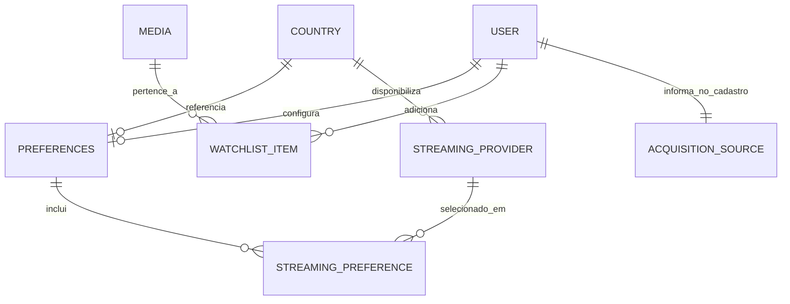
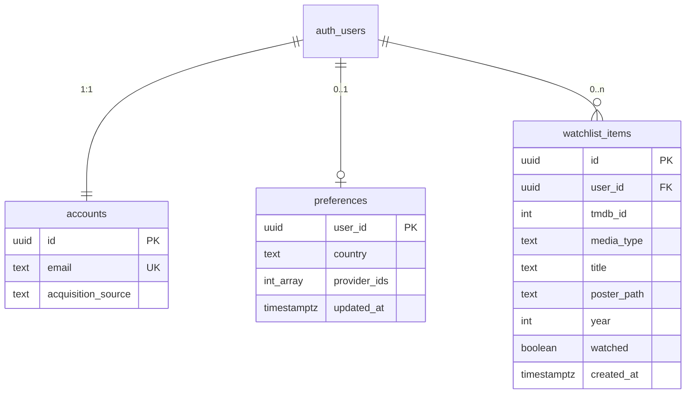

# SSD — Watchly

Última atualização: 19 de setembro de 2026

Este arquivo é a fonte da verdade técnica do sistema. Comportamento e regras de negócio vivem em `docs/PRD.md`. Decisões arquiteturais relevantes ficam em `docs/decisions/`.

O PRD descreve o comportamento aprovado e desejado. Este SSD descreve o sistema como ele é agora.

## Visão geral da arquitetura

### Current architecture

O Watchly é um app Next.js (App Router). O browser renderiza a UI e chama route handlers do próprio Next para o catálogo. Conta, preferências e watchlist passam pelo contrato `lib/account` e persistem no Supabase (Auth + Postgres + RLS). Os route handlers de catálogo consultam a TMDB no servidor.

```text
Browser (Client Components)
  ├── AccountProvider → lib/account → Supabase Auth + RLS
  ├── Rotas públicas: home, busca, detalhe
  ├── AuthGuard: watchlist, onboarding, perfil
  └── fetch → /api/*

proxy.ts
  └── só renova o cookie de sessão (@supabase/ssr)

app/auth/callback
  └── troca o code PKCE

Route Handlers (app/api/*)
  └── lib/catalog/* + lib/tmdb/*  (import "server-only")
        └── TMDB API v3 (Bearer TMDB_ACCESS_TOKEN)
```

As telas não importam o cliente TMDB nem o SDK do Supabase. Conta, preferências e watchlist passam pelo contrato em `lib/account`.

Home, busca e detalhe são públicos. Visitante usa `region=BR` e lista vazia de provedores.

Não copiar do protótipo HTML: `localStorage` de API key, chamada direta à TMDB no browser ou mocks de catálogo.

A abstração de conta permanece ([ADR-002](decisions/ADR-002-account-abstraction.md)). A persistência é Supabase ([ADR-005](decisions/ADR-005-supabase-account.md)).

## Stack

| Camada | Escolha |
| --- | --- |
| Framework | Next.js 16.3.2 (App Router) |
| UI | React 19.2.8 |
| Linguagem | TypeScript |
| Estilo | Tailwind CSS 4 |
| TMDB no servidor | `server-only` + `fetch` com Bearer |
| Conta | Supabase Auth + Postgres + RLS |
| Testes | Vitest 3.2.4 (unitários em `lib/`) |

Há `@supabase/supabase-js` e `@supabase/ssr`. Sem ORM, server actions nem React Query/SWR. `proxy.ts` só renova o cookie; não protege rota.

## Estrutura do projeto

```text
app/
  layout.tsx                 AccountProvider, ToastProvider, lang=pt-BR
  (auth)/                    login, cadastro, senha (sem nav)
  (browse)/                  home, busca, detalhe (públicos)
  (app)/                     watchlist, perfil
  (setup)/                   onboarding isolado, sem nav, com atribuição
  api/                       catalog, search, title, meta, watch-providers
  auth/callback/             troca o code PKCE da sessão
components/                  UI e guards
hooks/                       leave-then-navigate, cascata de entrada, navegação do shell
lib/
  account/                   contrato público → supabase/
  supabase/                  clientes browser/server e tipos
  catalog/                   discover, merge, hydrate, detalhe
  tmdb/                      cliente e queries
  api.ts                     fetch helpers do browser
  http.ts                    erros e região obrigatória nas APIs
  media.ts                   filme/serie ↔ movie/tv
  motion.ts                  tokens, identidade de tela e helpers de entrada/saída
```

Há `proxy.ts` só para renovar o cookie do Supabase. Grupos de rota: `app/(browse)` público e `app/(app)` autenticado (watchlist, perfil) compartilham o mesmo chrome; `app/(setup)` autenticado sem nav (onboarding), com atribuição; `app/(auth)` para visitante, sem wordmark no header. Viewport em `app/layout.tsx`: `viewportFit: "cover"` e `interactiveWidget: "resizes-content"`. No compacto (`< 640px`) o chrome é `CompactChrome` + `CompactTabBar` (`sm:hidden`): topo em uma linha (Watchly + conta, e na Home um botão de sliders depois da conta, com `pt` de safe-area); tab bar fixa no rodapé com cinco itens (Início, Filmes, Séries, Busca, Lista), cantos superiores arredondados e `pb` de safe-area. A busca não está no topo. `AppShell` envolve o chrome em `HomeFilterChromeProvider`; `CatalogHome` publica o slot (gêneros, provedores, `showProviderFilter`, contagem); o botão só monta em `/`. `CatalogFilterSheet` (`z-[70]`, `sm:hidden`, `role="dialog"`) fica fora do `PageMotionFrame`, acima da tab bar; fecha no overlay, Escape, botão fechar, pathname ≠ `/` ou `matchMedia('(min-width: 640px)')`. `CatalogFilters` tem `layout="strip"` (`hidden sm:flex` abaixo do hero) e `layout="stack"` no sheet. A partir de `sm` o chrome é `PillChrome` flutuante (Início, Filmes, Séries, Watchlist, ícone de busca, conta); no médio o nome some e fica o avatar; no amplo (`lg`) o nome curto volta. `AppShell` aplica `pb-chrome` e o padding-top por rota: flush (`/` e `/titulo/*`) usa `pt-chrome pb-chrome sm:pt-0 sm:pb-0`; Watchlist e Busca usam `pt-content` (`--chrome-header` + `--content-gap` de 32px) e `px-5 sm:px-12`; as demais usam `pt-chrome` e também `px-5 sm:px-12`. A home e o detalhe ocupam a largura toda (hero/backdrop edge-to-edge). Sem hero (erro ou lista vazia), a Home aplica `sm:pt-chrome` para não ficar sob a pill. A atribuição no compacto soma `--chrome-bottom` no padding inferior. Auth e onboarding não montam o shell nem a tab bar. O chrome (topo e tab bar) não recebe `.d-leaving`. A Home busca o Hero à parte da grade (`sort=trending`, página 1, sem filtros da URL); só o país de referência entra. `sort=trending` usa `/trending/all/week`, descarta pessoa e adulto, hidrata ofertas e fica só com título que tem still e oferta no país. O Hero mede o parágrafo da sinopse no client e escolhe um candidato extrativo que caiba em 3 linhas. `/verificar-email` redireciona para `/login`. Logout volta para `/`.

Tokens visuais em `app/globals.css`: fundo `#0b0c10`, texto `#f2f3f5`, positivo/alerta em oklch, sem ember como accent. Chrome: `--safe-top` / `--safe-bottom` via `env(safe-area-inset-*)`; `--chrome-bar: 49px`; `--chrome-tab: 57px`; `--chrome-pill: 110px`; `--content-gap: 32px`; no compacto `--chrome-top` e `--chrome-header` somam safe-area + barra, `--chrome-bottom` soma tab + safe-area, `--hero-height` é `50dvh` (mínimo; o frame cresce com o copy) e `--hero-copy-anchor` é `315px`; a partir de 640px `--chrome-top` é a pill (`110px`), `--chrome-header` é `68px` (ocupação da pílula), `--chrome-bottom` soma `70px` + safe-area, `--hero-height` é `64vh` e `--hero-min-height` é `520px`. Utilitários `pt-chrome`, `pt-content`, `pb-chrome`, `pt-safe`, `pb-safe`, `scroll-mb-safe`, `hero-frame`, `hero-copy`. No compacto o copy do Hero é in-flow com `padding-top` `max(0px, 50dvh - 315px)`; a partir de 640px o copy volta a `absolute bottom`. Nav: `rgba(16,17,23,.7)` + blur 20. Grade (`CatalogGrid`): 2 colunas no compacto, 3 em `sm`, `repeat(auto-fill, minmax(176px, 1fr))` em `lg`; `TitleCard` usa `sizes` `50vw` / `33vw` / `176px`. Detalhe: coluna no compacto (pôster 168px, overlap `-56px`); row a partir de `sm` (pôster 230px, overlap `-170px`); nome da oferta com `truncate` e badge `shrink-0`. Watchlist: card em coluna no compacto; status em largura cheia; disponibilidade no máximo dois nomes + “e mais”. Auth e onboarding: `min-h-dvh`, `pt-safe`, `justify-center-safe`; onboarding e ações do Perfil também `pb-safe`; CTAs com `scroll-mb-safe`. Auth: card 404px com gradiente `#191c22 → #101216` e atmosphere azul. Toast de watchlist é efêmero no client.

Movimento de tela no shell (Home, busca, detalhe, Watchlist, Perfil): classes `.d-back`, `.d-in` e `.d-leaving` em `globals.css` (entrada 400ms / `translateY(14px)`, saída 260ms / `translateY(8px)`). `PageMotionProvider` no `AppShell` expõe `leaveThen`; o frame de saída é chaveado pela identidade da tela (`lib/motion.ts`) para o leave não prender a rota seguinte. `.d-leaving` fica só nesse frame, não no chrome. A identidade da Home inclui só `media`: `home`, `home:movie`, `home:tv`. Gênero, ano, sort e provedor não mudam a identidade. A origem da comparação usa pathname + search, não só o pathname. `ScreenLink` e `useScreenNavigate` interceptam o clique primário quando origem e destino são telas diferentes do shell; o filtro Tipo da Home também passa por `leaveTo`. Digitação na busca, demais filtros e destino auth/onboarding não passam pelo leave. Durante os 260ms há `prefetch` da rota e, em URL de título, `fetchTitle`; destino Home também aquece catálogo, hero, meta e provedores (cache in-flight + peek em `lib/api.ts`). O guard de reentrada é um ref. Depois de 1100ms o Hero tira `.d-in` dos filhos para a troca de slide não re-animar o texto. Busca, Watchlist e Perfil entram só com cascata de conteúdo (sem `.d-back`). Auth e onboarding mantêm `.fade-up`. `prefers-reduced-motion: reduce` desliga a cascata e o atraso de saída.

## Domínios e módulos principais

### Account

Contrato público atual:

- `lib/account/session.ts` — cadastro, login, logout, confirmar email, reset e atualizar senha
- `lib/account/preferences.ts` — país + `providerIds` (≥1)
- `lib/account/watchlist.ts` — add, remove, list, isSaved, setWatchlistWatched
- `lib/account/types.ts` — `Session`, `Preferences`, `WatchlistItem`, `AcquisitionSource`
- `lib/account/watch-status.ts` — rótulos **Ainda não assistido** / **Já assistido**

Implementação atual: `lib/account/supabase/*`. Funções públicas são assíncronas. Ver [ADR-002](decisions/ADR-002-account-abstraction.md) e [ADR-005](decisions/ADR-005-supabase-account.md).

`AccountProvider` usa `useSyncExternalStore` sobre o store em memória e hidrata sessão, preferências e watchlist no cliente.

Cadastro exige origem de aquisição. Sessão só tem status `authenticated`.

### Catalog

- `get-catalog.ts` — Discover Movie/TV, merge, hidratação de ofertas
- `get-search.ts` — Search Movie/TV, merge, hidratação (`onlyOwn=false`)
- `get-title.ts` — detalhe, créditos, ofertas, trailer
- `get-meta.ts` — países, gêneros mesclados por nome, provedores por região
- `discover-query.ts` — query TMDB com região, providers (`|` = OR), monetização, adulto desligado
- `hydrate.ts` — uma chamada de watch/providers por item visível
- `merge.ts` — junta filme e série, deduplica, ordena
- `hero-params.ts` — query do Hero (`page=1`, `sort=trending`), sem filtros da listagem
- `trending.ts` — mapeia `/trending/all/week` e escolhe os itens do Hero (still + oferta)
- `hero-synopsis.ts` — candidatos extrativos da sinopse e escolha do texto que cabe em 3 linhas no Hero

Discover sem `with_watch_providers` quando a lista está vazia; hidratação com `onlyOwn=false`. Visitante: `region=BR`. Filtro de provedor opcional na UI. Faixas de ano via `yearRange`.

O BFF de trailer pode permanecer sem superfície de produto. O PRD não inclui trailer nem link do título na TMDB.

### TMDB

Cliente único em `lib/tmdb/client.ts`. Queries em `lib/tmdb/queries.ts`. URLs de imagem em `lib/tmdb/image.ts` (usável no client; só paths públicos da CDN).

## Modelo de domínio

Entidades de negócio do Watchly. **Profile** não é entidade persistida: a tela Perfil é UI sobre User e Preferences.

| Conceito | Responsabilidade | Existe hoje? |
| --- | --- | --- |
| User | Identidade da sessão (e-mail). Hoje: `Session` sobre `auth.users`. | Sim |
| Acquisition source | Origem informada no cadastro. Lista fechada. Não é editável depois. | Sim, em `accounts` |
| Preferences | País de referência + streamings escolhidos (≥1). | Sim |
| Country | Conjunto de produto: `BR`, `US`, `PT`. A TMDB continua sendo a fonte de provedores da região. | Sim, na UI |
| Streaming provider | Serviço de streaming da TMDB numa região. | Sim, como dado de catálogo (`WatchProvider`) |
| Streaming preference | Vínculo entre a conta e um provedor escolhido. | Sim, como `providerIds[]` em Preferences |
| Media | Filme ou série da TMDB. Não é persistido como registro próprio. | Sim, só em runtime |
| Watchlist item | Título guardado pela conta, com status de visualização e snapshot de UI. | Sim |

## Diagrama entidade-relacionamento conceitual

Domínio do produto, independente da estrutura física.



## Diagrama de relacionamento de entidades

Schema em `supabase/migrations`. Identidade física: `auth.users.id`. A UI continua lendo `{ session, preferences, watchlist }`.

```text
auth.users          { id, email, senha }
public.accounts     { id FK, email, acquisition_source }
public.preferences  { user_id PK, country, provider_ids[], updated_at }
public.watchlist_items { id, user_id, tmdb_id, media_type, title, poster_path, year, watched, created_at }
```



Identidade de um item: `user_id + media_type + tmdb_id`. Ver [ADR-003](decisions/ADR-003-watchlist-identity.md).

Catálogo em runtime (`lib/catalog/types.ts`): `CatalogItem`, `TitleDetails`, `Offer`. Sem tabelas `profiles`, `streaming_providers` nem ofertas persistidas.

## Persistência

Postgres no Supabase. RLS: cada usuário só lê e escreve as próprias linhas. `accounts` não tem UPDATE (origem só no cadastro). Trigger em `auth.users` cria a linha de `accounts`.

Na watchlist, `title`, `poster_path` e `year` são snapshot de UI. Disponibilidade **não** é gravada. `watched` nasce `false`.

Dados do mock `localStorage` não foram migrados.

## Autenticação

Supabase Auth, e-mail e senha. Validação no app: e-mail com formato válido; senha com pelo menos 6 caracteres; origem obrigatória no cadastro.

Login distingue conta inexistente e senha errada via RPC `email_registered`. Recuperação chama `resetPasswordForEmail` e sempre mostra confirmação neutra.

Proteção de rotas no cliente:

- `AuthGuard` — sem sessão → `/login`; sem preferências → `/onboarding`
- `GuestGuard` — autenticado não permanece nas telas de auth, exceto `/atualizar-senha`
- Home, busca e detalhe sem sessão
- Logout → `/`

`proxy.ts` só renova o cookie. As rotas `/api/*` **não** verificam sessão.

## Integração com TMDB

Toda chamada autenticada à TMDB passa por módulos com `import "server-only"`. Token: `TMDB_ACCESS_TOKEN` (sem `NEXT_PUBLIC_`). Header `Authorization: Bearer`. Base `https://api.themoviedb.org/3`. Idioma padrão `pt-BR`. `include_adult=false` em discover e search.

Ver [ADR-001](decisions/ADR-001-tmdb-server-side.md).

Endpoints usados:

| Recurso | Path |
| --- | --- |
| Configuration | `/configuration` |
| Países | `/configuration/countries` |
| Gêneros | `/genre/movie/list`, `/genre/tv/list` |
| Provedores | `/watch/providers/movie`, `/watch/providers/tv` |
| Discover | `/discover/movie`, `/discover/tv` |
| Search | `/search/movie`, `/search/tv` |
| Detalhe | `/movie/{id}`, `/tv/{id}` |
| Créditos | `/movie/{id}/credits`, `/tv/{id}/credits` |
| Ofertas | `/movie/{id}/watch/providers`, `/tv/{id}/watch/providers` |
| Vídeos | `/movie/{id}/videos`, `/tv/{id}/videos` |

### Current

Discover da home: `watch_region`, `with_watch_providers` (OR), `with_watch_monetization_types`. A home não filtra título a título antes do Discover. Depois do merge, `hydrateOffers(..., onlyOwn=true)` busca watch/providers só dos itens visíveis.

Busca: Search Movie + Search TV, sem filtro de provedor; hidratação com `onlyOwn=false`.

Detalhe: details + credits + watch/providers da região + videos. Trailers: YouTube, com `include_video_language=pt-BR,en,null`.

Imagens: `image.tmdb.org` (`next.config.ts`).

Países de produto na UI: `BR`, `US`, `PT`. Provedores vêm da TMDB por região. Home pública: `providers` opcional, visitante `BR`, hidratação com ofertas do país. Paginação permanece como limitação da TMDB. Trailer pode continuar no BFF sem superfície de produto.

## Integração com Supabase

Projeto remoto + clientes `@supabase/ssr`. Env: `NEXT_PUBLIC_SUPABASE_URL` e `NEXT_PUBLIC_SUPABASE_PUBLISHABLE_KEY` (fallback: `NEXT_PUBLIC_SUPABASE_ANON_KEY`). Sem service role no app.

Confirm email desligado no dashboard. Redirects de Auth: `/auth/callback` e origem do app. Schema versionado em `supabase/migrations`. Ver [ADR-005](decisions/ADR-005-supabase-account.md).

## APIs e contratos

Cinco route handlers GET. Sem `"use server"`.

| Rota | Função | Params relevantes |
| --- | --- | --- |
| `GET /api/catalog` | Página de catálogo | `region` (obrigatório), `providers` (opcional), `page`, `media`, `yearRange`, `sort`, `filterProviders` |
| `GET /api/search` | Busca | `q` (obrigatório), `region`, `providers`, `page` |
| `GET /api/title/[tipo]/[id]` | Detalhe | `tipo` = `filme` \| `serie`, `region`, `providers` |
| `GET /api/meta` | Países e gêneros | — |
| `GET /api/watch-providers` | Provedores da região | `region` |

`requireRegion` exige ISO-2. Query de busca vazia não chama a TMDB.

### Current

`GET /api/catalog`: `providers` é opcional. Visitante consulta com `region=BR`. Conta autenticada envia o país salvo e os provedores só para personalizar ou filtrar.

Identidade da watchlist: `user_id + mediaType + tmdbId`. Ver [ADR-003](decisions/ADR-003-watchlist-identity.md).

## Segurança

- Token TMDB só no servidor
- Imagens públicas da CDN no client
- Conta protegida por RLS e JWT do Supabase
- `/api/*` é um proxy TMDB sem sessão e sem rate limit próprio (além do 429 da TMDB)
- Senhas ficam no Auth do Supabase; o app não grava senha

A home pública torna o proxy de catálogo ainda mais alinhado ao produto. Continua sem autenticação de usuário nas rotas `/api/*`.

## Cache

`tmdbFetch` usa `fetch(..., { next: { revalidate } })`.

| Dado | TTL |
| --- | --- |
| Configuration, países, gêneros | 24 h |
| Provedores por região | 12 h |
| Discover / search | 15 min |
| Detalhe, créditos, vídeos, watch/providers por título | 6 h |

Não há `unstable_cache` nem `revalidate` de segmento nas rotas. Hidratação de ofertas que falha devolve o item com `offers: []`.

Disponibilidade é sempre consultada na TMDB (com esse cache HTTP), nunca persistida. Ver [ADR-004](decisions/ADR-004-live-availability.md).

Uma home sem filtro de provedor aumenta o volume de Discover e de hidratação.

## Tratamento de erros

- TMDB: `TmdbError` para 401, 404, 429 e demais falhas
- Route handlers: `jsonError()` — 401 da TMDB vira 502; `Error` vira 400; resto 500
- Conta: `AccountError` + `ACCOUNT_ERROR_COPY` na UI
- UI: `StatusPanel` para vazio, erro e retry; `role="alert"` nos forms

Mensagens de origem de aquisição e de gate de visitante estão na UI.

## Decisões técnicas atuais

- TMDB só no servidor, via BFF Next, não no browser e não em Edge Function
- Conta atrás de um contrato (`lib/account`) com implementação Supabase
- Watchlist identificada por `user_id + mediaType + tmdbId`
- Disponibilidade live na TMDB; watchlist guarda só snapshot de UI
- Guards de rota no cliente; `proxy.ts` só renova cookie
- Grade mista: mesma `page` nos dois Discovers, merge e ordenação no servidor, “Carregar mais” na UI
- Gêneros de filme e série mesclados por nome para a UI
- Conteúdo adulto sempre desligado na query

## Limitações técnicas

- Depende do projeto Supabase (Auth, Postgres e e-mail de recovery)
- APIs de catálogo públicas (qualquer cliente com `region`)
- Páginas majoritariamente Client Components; pouco SSR de dados TMDB
- `applyCountryChange()` existe no contrato de preferências, mas a UI salva só via `savePreferences()` no submit do formulário
- A listagem não carrega o catálogo inteiro de uma vez; a paginação é restrição da TMDB, não requisito de UX

## Dívida técnica conhecida

- `hydrateOffers` faz uma chamada TMDB por item visível (N+1), mitigada pelo cache de 6 h
- Sem testes de componente, rota ou E2E; só unitários em `lib/`
- Proteção de rotas só no cliente
- Proxy TMDB sem autenticação de usuário nem cota própria

## Decisões pendentes

1. Customizar o template do e-mail de recuperação em português no dashboard do Supabase.
